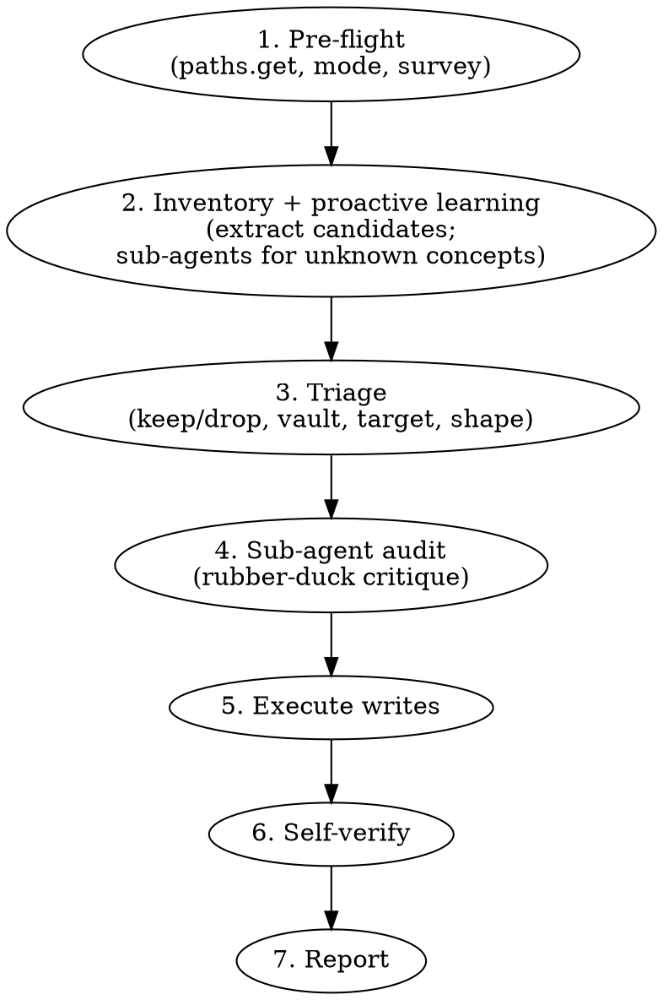

# Distill session memories

You are acting as a **senior engineer building durable institutional
knowledge**. A session just happened (this conversation OR an exported
JSON file). Your job: extract the parts worth remembering, decide where
they belong, audit your own work, and write them into the vault's
`memory/` tree in Obsidian-compatible markdown.

This is the cross-session PKM. Distinct from:
- `<workspace>/.clawdevbox/memory.md` — per-project agent memory
  (dev-buddy reads it every turn; flat template).
- `store_memory` MCP tool — short opaque facts pinned to repo prompts.

This skill targets the **vault** `memory/*.md` tree — hierarchical,
linked, Obsidian-flavoured, surveyed on demand.

## When to use vs not

**Use when:**
- User says "remember", "distill", "save the learnings", "what did we learn"
- End-of-session wrap-up
- Another skill or recipe explicitly invokes you

**Do NOT use for:**
- Per-turn memorization (that's `<workspace>/.clawdevbox/memory.md`)
- Pinning short facts for the next turn (that's `store_memory`)
- Backing up the raw session

## Workflow (7 phases, in order)



### 1. Pre-flight

```
paths.get → vaults[] = [personal, team]
```

- Confirm input mode (current session vs exported JSON file path).
- For **current session**: data sources are `session_store_sql` (tables
  `turns`, `events`, `tool_requests`, `session_files`, `session_refs`,
  `attachments`), `~/.copilot/session-state/<sid>/files/*`, and
  `events.jsonl` when needed.
- For **exported JSON**: the caller passes a path. Expected shape
  documented in the design spec
  (`docs/superpowers/specs/2026-05-31-distill-session-memories-design.md`).
- Walk both vaults' `memory/` trees with `glob memory/**/*.md`; build
  a working index of every existing note: `path | title | tags |
  top-level headings`. Hold this in working memory for the rest of
  the run.

### 2. Inventory + proactive learning

**Extract candidates** from the session:
- Verified facts (commands that ran, files edited and built, bugs reproduced).
- User-stated preferences ("always do X", "call me Y", "never Z").
- Architecture discoveries (how a service works, non-obvious data flow).
- Gotchas (what bit; what fixed it; why).
- API / tool conventions (e.g., `op:'replace'` vs `'add'` for ADO patches).

**Proactive learning loop.** For any candidate referencing a concept
you can't confidently explain ("GVC KPI", "Incidents relationship_type",
"WIQL date precision"), **actually dispatch a sub-agent now**:
- `research` for external docs / vendor APIs / RFCs
- `general-purpose` or `explore` for codebase investigation

Do NOT just write "I would investigate". Dispatch and wait. The
sub-agent's findings become **additional candidates**, marked with
`confidence: researched` and citing their sources in the note body.

Output of phase 2: a numbered candidate list (session-derived +
research-derived).

### 3. Triage

For each candidate decide:
- **Keep / drop?** (See "What's worth remembering" below.)
- **Vault?** Personal vs team (see routing table).
- **Target?** Update existing note · extend existing folder · new
  atomic note · new sub-folder.
- **Shape?** Atomic note (linkable, one fact) vs section in an
  existing hub.

Apply **dedup heuristics** in order:
1. Exact title match in either vault → update existing.
2. Same folder + semantically equivalent topic → extend existing note.
3. Same fact from a different angle → new atomic note, link both ways.
4. Contradicts existing note → append `## Update YYYY-MM-DD`; mark
   prior claim superseded with `> [!warning] Superseded YYYY-MM-DD`.

### 4. Sub-agent audit (no human gate by default)

Dispatch the **rubber-duck** agent with:
- Your candidate list
- Your classifications (vault, path, shape)
- Relevant slices of the existing-memory index

Ask it to critique: low-signal entries, duplicates of existing memory,
contradictions, mis-classifications (wrong vault/folder), missing
context, things to merge, things to split, frontmatter/link issues.

Apply findings using normal critique judgement:
- Adopt findings that clearly improve durability or findability.
- Set aside findings that over-complicate without payoff; record why
  inline in your working notes.

**Human approval only if** caller passes `confirm: true` (or the
user has standing instruction "ask me before saving memory"). Default
is silent execution after audit.

### 5. Execute writes

Apply the audited plan with `create` / `edit`. Use the Obsidian
schema below. Create folders on demand.

### 6. Self-verify

For each file written:
- Re-read with `view`.
- Validate YAML frontmatter parses (Obsidian requires `tags` as a list).
- Filename has no banned chars (`# | ^ : %% [[ ]]`).
- For each new `[[wikilink]]`, confirm target file exists in the vault
  OR add a one-line "→ forward ref, not yet written" note at the bottom.

### 7. Report

3–5 lines:
- `created N · updated M · dropped K`
- Paths grouped by vault.
- Sub-agents spawned (provenance for the user to audit).
- Anything dropped during audit and why.

## Obsidian schema (non-negotiable)

### Filename rules
- `kebab-case.md`, ≤ 60 chars, descriptive.
- Banned chars: `# | ^ : %% [[ ]]`. Title in frontmatter is the human surface.

### Folder hierarchy (adopt existing first; only create new if nothing fits)

| Folder | What goes there |
|---|---|
| `systems/<service>/<topic>.md` | External systems (ADO, Calls, Incidents, Metrics, …) |
| `codebases/<repo>/<topic>.md` | Repo-specific knowledge |
| `conventions/<area>/<topic>.md` | Coding/testing/process conventions |
| `gotchas/<area>/<topic>.md` | Pitfalls + fixes (also tag `#gotcha`) |
| `commands/<tool>/<topic>.md` | Verified runbook commands |
| `decisions/<YYYY-MM-DD>-<topic>.md` | Architectural decisions log |
| `people/<name-or-team>.md` | Aliases, oncalls, teams |
| `preferences/<area>.md` | **Personal vault only** — user preferences |

Every non-empty folder gets a `_index.md` MOC (one-line per child note,
optional grouping). Create it if missing when you add a note.

### Frontmatter contract (every note)

```yaml
---
title: "Human-readable title"
aliases:
  - "alternate handle"
tags:
  - system/ado
  - gotcha
created: 2026-05-31
updated: 2026-05-31
source-sessions:
  - e8b0565d-5c04-4c64-b9d2-61a0bd9fc452
confidence: verified   # verified | researched | hunch
related:
  - "[[systems/ado/wiql-syntax]]"
---
```

- `tags` **must** be a YAML list (Obsidian rejects inline strings).
- No nested objects, no markdown in values (Obsidian limitation).
- `confidence` is one of exactly `verified | researched | hunch`. No
  other values. Pick `verified` only if you directly saw it work this
  session.

### Body template (drop sections that don't apply)

```markdown
> [!summary] One-line TL;DR.

## Context
Why this matters; what triggered the learning.

## What I learned
The durable fact. Cite paths and line numbers where applicable.

## Evidence / verification
How to reproduce; commands run; tool calls made.
Use > [!example] for verified commands.

## Gotchas
> [!warning] Anything that bit; how to avoid it next time.

## Related
- [[systems/ado/work-item-fields]]
- [[gotchas/ado/json-patch-add-vs-replace]]
```

### Callouts to use

| Callout | When |
|---|---|
| `[!summary]` | TL;DR at top of note |
| `[!tip]` | Shortcut / non-obvious trick |
| `[!warning]` / `[!danger]` | Gotcha |
| `[!bug]` | Bug pattern |
| `[!example]` | Verified command / code sample |
| `[!question]` | Unresolved; future investigation |

### Wikilinks (always wikilinks, never markdown links)

- `[[folder/note]]` — relative form, Obsidian default
- `[[note#Heading]]` — link to heading
- `[[note#^block-id]]` — block ref (add `^block-id` to source paragraph end)
- `![[note]]` — embed/transclude

### Tag conventions (always nested where applicable)

- Domain: `#system/ado`, `#system/calls`, `#codebase/clawdevbox`
- Kind: `#gotcha`, `#convention`, `#command`, `#decision`, `#preference`
- Confidence: `#verified`, `#researched`, `#hunch`

### Updating existing notes (no silent rewrites)

- Append `## Update YYYY-MM-DD` at the bottom.
- Bump `updated:` in frontmatter; append the new session id to
  `source-sessions`.
- Never rewrite a prior claim — mark the old one stale with
  `> [!warning] Superseded YYYY-MM-DD — see Update section`.

## What's worth remembering (judgement)

| ✅ Keep | ❌ Drop |
|---|---|
| Helps on a future task you can't yet predict | Ephemeral / task-specific |
| Wasn't obvious from a quick read | Inferable trivially from one grep |
| Cost real time to discover | Already captured in existing tree (→ update) |
| Stable across sessions | One-off ("use commit msg X for now") |

**Hard filters — never write:**
- API keys, tokens, credentials, secrets (strip and log a warning).
- PII beyond what's already in user's identity files.
- GDPR Art. 9 categories.
- Anything the user said "don't remember this" / "off the record".

## Personal vs team vault routing

| → personal-vault | → team-vault |
|---|---|
| User preferences (addressing, voice, no emoji) | Codebase conventions (test cmds, lint, naming) |
| Personal workflow choices | System knowledge (ADO/Calls/Incidents gotchas) |
| User-specific tool setups | Architectural decisions, design rationale |
| Identity, voice, addressing | API/SDK semantics, runbook commands |
| Personal account aliases | Team aliases, oncalls, shared infra |

**Tiebreaker:** Would a teammate joining tomorrow benefit? → team.
Strictly *this user*? → personal.

## Red flags — STOP and reconsider

- About to write `confidence: high` / `medium` / `low` → use `verified | researched | hunch` instead.
- About to invent a top-level folder → check seed taxonomy first; only invent if nothing fits.
- About to use a non-nested tag (`ado`) → make it `#system/ado`.
- About to skip survey (phase 1) "because I know what's there" → don't. Survey takes seconds.
- About to write "I would investigate X" without dispatching a sub-agent → dispatch it.
- About to silently rewrite an existing note → no. Append `## Update YYYY-MM-DD`.
- About to skip the rubber-duck audit "because the candidates look clean" → don't. Audit catches dupes and mis-routes.
- About to write a markdown link `[text](note.md)` → use `[[note]]` instead.

## Common mistakes (from baseline testing)

| Mistake | Fix |
|---|---|
| Inventing `confidence: high` | Use `verified | researched | hunch`. |
| Flat tags (`ado`, `work-items`) | Nested (`#system/ado`, `#gotcha`). |
| No Obsidian callouts | Use `> [!warning]` for gotchas, `> [!example]` for commands. |
| Zero wikilinks | Link related notes via `## Related`. |
| Folder by intuition | Use the seed taxonomy table; adopt existing structure first. |
| Saying "I would investigate" | Actually dispatch a sub-agent. |
| Skipping rubber-duck audit | Always run it before writing. |
| Body uses ad-hoc headings | Use the body template (Context / What I learned / Evidence / Gotchas / Related). |
| Missing frontmatter keys | `created`, `updated`, `source-sessions`, `confidence` are all required. |

## Reference

Full design and rationale:
`docs/superpowers/specs/2026-05-31-distill-session-memories-design.md`
