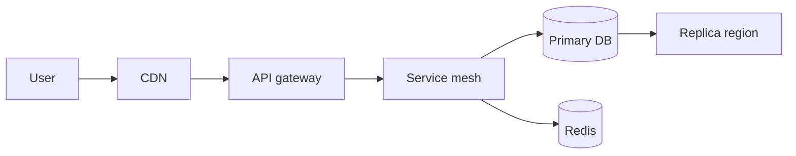

# Q3 Engineering Plan

This document outlines our engineering priorities for the third quarter.
It is a working draft — comments encouraged.

## Goals

Drive 30% YoY growth in active users by shipping the new onboarding flow,
the mobile-share feature, and a redesigned home tab. We also intend to
reduce p99 latency in the search path by 40% and ship cross-region
disaster-recovery for the message store.

## Architecture overview

Below is the high-level flow for a user request.

The hot path uses the cache for read-heavy endpoints. The fallback region
takes over within ~12 seconds of a primary outage.

## A reference image

## Budget

We allocate $1.8M across the following buckets:

- Eng salaries — $1.2M
- Infra — $420k (AWS + observability)
- Tooling — $180k

Note that the infra figure does *not* include the new GPU cluster we're
provisioning for the recommendation team — that has its own line item in
the data-platform sub-budget.

## Risks

The single largest risk is **dependency on the new auth platform** shipping
by July. If it slips to August, the onboarding-flow launch slips with it.

A secondary risk is staffing — we are still hiring for two senior backend
roles on the messaging team.

## Open questions

- Do we co-locate the new ML inference cluster with the primary DB region?
- Should we sunset the legacy mobile SDK in Q3 or defer to Q4?
- How aggressive do we want to be on opening a third region?
